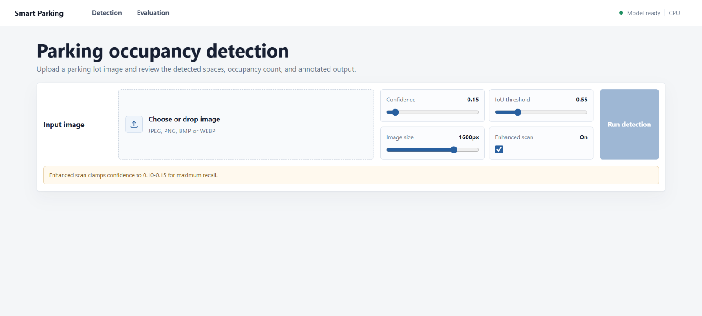
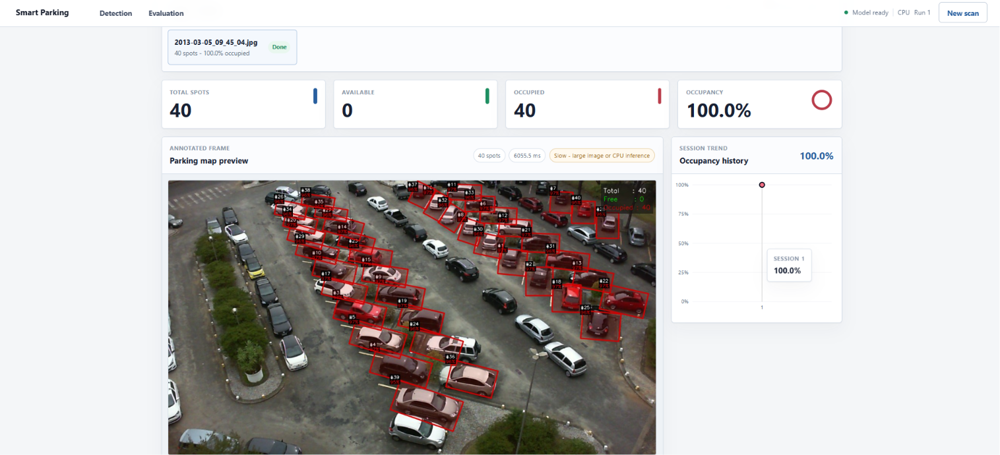

# Smart Parking System

> YOLOv8-OBB powered parking occupancy detection — full-stack, production-ready.

A full-stack computer vision system that detects parking spaces from overhead lot images and classifies each space as **available** or **occupied** using a YOLOv8 oriented bounding box model. Includes a FastAPI inference backend, React dashboard, batch processing, model evaluation views, and live API runtime metrics.

---

## Demo

| Detection Page | Batch Results |
|---|---|
|  |  |

> Model: YOLOv8m-OBB · Dataset: PKLot · mAP50: **99.48%** · mAP50-95: **99.47%**

---

## Features

- Upload JPEG, PNG, BMP, or WEBP parking-lot images
- Detect rotated parking spaces via YOLOv8-OBB
- Classify each space as available or occupied
- View total spots, available, occupied, occupancy %, and inference time
- Annotated output image with per-space overlays
- Batch detection across multiple images
- Model evaluation page with confusion matrix and per-class metrics
- Live API runtime metrics (request count, avg inference time, last request)
- Configurable confidence, IoU, image size, and enhanced tiled scan via sliders

---

## Model Performance

Evaluated on **1,863 test images** from the PKLot dataset.

| Metric | Score |
|---|---|
| Precision | 99.90% |
| Recall | 99.90% |
| mAP50 | 99.48% |
| mAP50-95 | 99.47% |

---

## Tech Stack

| Layer | Tools |
|---|---|
| Backend | Python 3.10+, FastAPI, Uvicorn, Pydantic |
| ML / Vision | YOLOv8-OBB (Ultralytics), PyTorch, OpenCV, NumPy, Shapely |
| Frontend | React 18, Vite, Axios, Recharts, Tailwind CSS |
| Training | Modal (cloud GPU), PKLot dataset |

---

## Project Structure

```text
.
├── backend/
│   ├── api/
│   │   └── routes.py          # FastAPI route definitions
│   ├── core/
│   │   └── config.py          # Environment-driven config (Pydantic Settings)
│   ├── models/
│   │   └── schemas.py         # Request/response Pydantic schemas
│   ├── services/
│   │   └── inference.py       # YOLOv8 inference + post-processing logic
│   ├── utils/
│   │   └── image_utils.py     # Image decode, encode, annotation helpers
│   └── main.py                # App factory, lifespan, CORS
├── frontend/
│   ├── src/
│   │   ├── components/        # Reusable UI components
│   │   ├── pages/             # Detection, Evaluation, Metrics pages
│   │   ├── services/          # Axios API client
│   │   ├── App.jsx
│   │   ├── index.css
│   │   └── main.jsx
│   ├── .env.example
│   ├── package.json
│   └── vite.config.js         # Dev proxy: /api → http://localhost:8000
├── models/
│   └── .gitkeep               # Placeholder — place best.pt here
├── training/
│   ├── train_modal.py         # Modal cloud training script
│   └── test_modal.py          # Modal evaluation script
├── .env.example
├── requirements.txt
└── README.md
```

---

## Requirements

| Dependency | Version |
|---|---|
| Python | 3.10+ |
| Node.js | 18+ |
| npm | bundled with Node |
| CUDA (optional) | Any CUDA-capable GPU; falls back to CPU automatically |

The trained model checkpoint (`models/best.pt`) is **not committed** to this repository due to file size. See [Model Checkpoint](#model-checkpoint) below.

---

## Setup

### 1. Clone the Repository

```bash
git clone https://github.com/BasuPatil09/Smart-Parking-System.git
cd Smart-Parking-System
```

### 2. Backend

Create and activate a virtual environment:

```bash
# Windows
python -m venv venv
venv\Scripts\activate

# Linux / macOS
python -m venv venv
source venv/bin/activate
```

Install Python dependencies:

```bash
pip install -r requirements.txt
```

Configure environment:

```bash
# Windows
copy .env.example .env

# Linux / macOS
cp .env.example .env
```

Backend environment variables (`.env`):

```env
CHECKPOINT_PATH=models/best.pt
DEVICE=auto                     # auto | cpu | cuda | mps
ALLOWED_ORIGINS=http://localhost:5173,http://127.0.0.1:5173
HOST=0.0.0.0
PORT=8000
EXPOSE_API_DOCS=true            # Set false in production
```

Start the backend:

```bash
uvicorn backend.main:app --reload --host 0.0.0.0 --port 8000
```

| Endpoint | URL |
|---|---|
| API | http://localhost:8000 |
| Swagger UI | http://localhost:8000/docs |
| Health Check | http://localhost:8000/health |

### 3. Frontend

```bash
cd frontend
npm install
```

Configure environment:

```bash
# Windows
copy .env.example .env

# Linux / macOS
cp .env.example .env
```

Frontend environment variables (`frontend/.env`):

```env
VITE_API_BASE_URL=/api
```

Start the development server:

```bash
npm run dev
```

Open: **http://localhost:5173**

> The Vite dev server proxies all `/api` requests to the backend at `http://localhost:8000`.

---

## Model Checkpoint

The trained checkpoint is not committed to this repository (137 MB binary). Download it from the [v1.0.0 Release](https://github.com/BasuPatil09/Smart-Parking-System/releases/tag/v1.0.0) and place it at `models/best.pt`.

**Download `best.pt`:**

```bash
# Linux / macOS
curl -L https://github.com/BasuPatil09/Smart-Parking-System/releases/download/v1.0.0/best.pt \
  -o models/best.pt

# Windows (PowerShell)
Invoke-WebRequest -Uri https://github.com/BasuPatil09/Smart-Parking-System/releases/download/v1.0.0/best.pt `
  -OutFile models\best.pt
```

The backend starts without it, but `POST /predict-image` returns `503 Model not loaded` until the file is present.

To train your own checkpoint from scratch, see [Training](#training).

---

## Test Images

The PKLot test set (1,863 images across UFPR04, UFPR05, and PUCPR lots) used for model evaluation is available as a release asset.

**Download `Test-Images.zip` (550 MB):**

```bash
# Linux / macOS
curl -L https://github.com/BasuPatil09/Smart-Parking-System/releases/download/v1.0.0/Test-Images.zip \
  -o Test-Images.zip
unzip Test-Images.zip -d data/test

# Windows (PowerShell)
Invoke-WebRequest -Uri https://github.com/BasuPatik09/Smart-Parking-System/releases/download/v1.0.0/Test-Images.zip `
  -OutFile Test-Images.zip
Expand-Archive -Path Test-Images.zip -DestinationPath data\test
```

Or download manually from the [v1.0.0 Release](https://github.com/BasuPatil09/Smart-Parking-System/releases/tag/v1.0.0).

Use these images with the batch detection feature or to run `training/test_modal.py` for full evaluation.

---

## API Reference

### `GET /health`
Returns backend liveness status.

### `GET /status`
Returns model load status, active device, and server uptime.

### `GET /metrics`
Returns runtime metrics: request count, average inference time, last request timestamp.

### `GET /model-evaluation`
Returns stored evaluation metrics displayed on the Evaluation page.

### `POST /predict-image`

Multipart form upload. Accepts JPEG, PNG, BMP, or WEBP.

| Parameter | Type | Default | Description |
|---|---|---|---|
| `image` | file | — | Parking lot image (form field) |
| `conf` | float | `0.15` | Detection confidence threshold |
| `iou` | float | `0.55` | NMS IoU threshold |
| `imgsz` | int | `1600` | YOLO inference image size (px) |
| `max_det` | int | `1000` | Maximum detections returned |
| `augment` | bool | `true` | Enable enhanced tiled scan for dense lots |

**Response fields:**

```json
{
  "total_spots": 28,
  "available": 2,
  "occupied": 26,
  "occupancy_pct": 92.9,
  "inference_ms": 573.6,
  "spots": [...],
  "annotated_image_b64": "<base64-encoded PNG>"
}
```

**Example (curl):**

```bash
curl -X POST "http://localhost:8000/predict-image?conf=0.15&iou=0.55&imgsz=1600&max_det=1000&augment=true" \
  -F "image=@parking_lot.jpg"
```

---

## Training

Training and evaluation scripts use [Modal](https://modal.com/) for cloud GPU execution against the [PKLot dataset](https://web.inf.ufpr.br/vri/databases/parking-lot-database/).

**Run training:**

```bash
modal run training/train_modal.py
```

**Run test evaluation:**

```bash
modal run training/test_modal.py
```

The scripts train a YOLOv8m-OBB model and produce a `best.pt` checkpoint. Copy the output checkpoint to `models/best.pt` before starting the backend.

---

## Frontend Build (Production)

```bash
cd frontend
npm run build
```

Preview the production build locally:

```bash
npm run preview
```

The compiled output is written to `frontend/dist/`. Serve it via a static host or configure FastAPI to mount it directly.

> Set `EXPOSE_API_DOCS=false` in `.env` before deploying the backend to production.

---

## Troubleshooting

**`503 Model not loaded`**
The checkpoint is missing. Place `best.pt` at `models/best.pt` and restart the backend.

**Frontend cannot reach backend**
Confirm the backend is running on port `8000` and `VITE_API_BASE_URL=/api` is set in `frontend/.env`.

**PowerShell blocks npm**

```powershell
npm.cmd run dev
npm.cmd run build
```

**`best.pt` not found after cloning**
Download it from the [v1.0.0 Release](https://github.com/BasuPatil09/Smart-Parking-System/releases/tag/v1.0.0) and place it at `models/best.pt`. The file is 137 MB and is not committed to the repository.

**Slow inference (CPU)**
The status bar in the UI shows the active device. CPU inference on large images (1600px) typically takes 500–800 ms. Enable CUDA by ensuring PyTorch with CUDA support is installed and `DEVICE=auto` is set.

---

## .gitignore Summary

The following are excluded from version control:

```text
venv/               # Python virtualenv
__pycache__/        # Python bytecode
frontend/node_modules/
frontend/dist/      # Frontend build output
.env                # Local secrets
frontend/.env
data/               # Dataset files
reports/ logs/ runs/
*.pt *.pth *.onnx *.engine   # Model checkpoints
```

Committed files include `.env.example`, `requirements.txt`, `package.json`, `package-lock.json`, `models/.gitkeep`, and all source code.

---

## License

MIT License — Copyright (c) 2026 Basu Patil